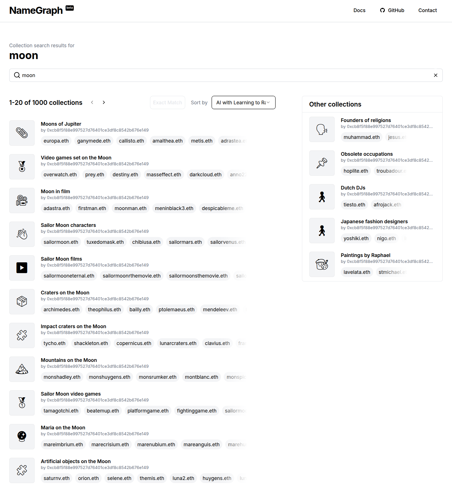

# NameGraph Collections Pipeline

A sophisticated data pipeline that creates meaningful collections of ENS domain names by analyzing Wikipedia and Wikidata knowledge graphs. The pipeline discovers relationships between names based on their conceptual connections - whether they belong to the same category, share similar attributes, or are commonly associated together.

## Overview

The pipeline processes Wikipedia and Wikidata dumps through multiple stages:

1. Extracts relevant data about categories, lists and their members
2. Maps relationships between entities across Wikipedia and Wikidata
3. Merges related collections and enriches them with metadata like:
   - Popularity scores
   - Domain registration status
   - Collection avatars and banners
4. Computes recommendations between related collections
5. Makes collections searchable through Elasticsearch in a schema used by [NameGraph](https://github.com/namehash/namegraph)

The system also handles user-created collections, enriching them with the same metadata and making them discoverable alongside Wikipedia-derived collections.

This creates an intuitive way for users to explore and find meaningful domain names based on their interests and use cases, leveraging the vast knowledge encoded in Wikipedia and Wikidata.

## Example

Wikipedia [Category of Pink Floyd Albums](https://en.wikipedia.org/wiki/Category:Pink_Floyd_albums) gets processed into a collection named **Pink Floyd Albums**. Some of the members of this collection are:

- [thedarksideofthemoon (The Dark Side of the Moon)](https://en.wikipedia.org/wiki/The_Dark_Side_of_the_Moon)
- [wishyouwerehere (Wish You Were Here)](https://en.wikipedia.org/wiki/Wish_You_Were_Here_(Pink_Floyd_album))
- [animals (Animals)](https://en.wikipedia.org/wiki/Animals_(Pink_Floyd_album))
- [thewall (The Wall)](https://en.wikipedia.org/wiki/The_Wall)
- [meddle (Meddle)](https://en.wikipedia.org/wiki/Meddle)

## NameGraph [[Github]](https://github.com/namehash/namegraph)

Building on this collections pipeline, NameGraph empowers ENS registrar apps to build new name discovery user experiences. Surf more than 21 million name ideas across more than 400,000 name collections, or generate infinite related name suggestions.

Visit NameGraph at [namegraph.dev](https://namegraph.dev) and [shoot for the moon](https://www.namegraph.dev/collections?search=moon)!

## Documentation

Take a closer look at the way collections templates pipeline works in [docs](docs/readme-internal.md).
