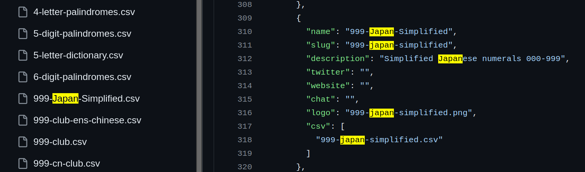

# ENS Clubs to Custom Collections Workflow

The whole process is implemented in the `convert_to_custom_format.py` script. The script is designed to be run from the command line and takes the following arguments:

```bash
python convert_to_custom_format.py -o <output_directory> --save_repo
```

Since we are using the external Github repository, the `--save_repo` flag is used to save the repository after the script execution. The `--save_repo` flag is optional and can be omitted if the repository is not needed.

The script goes through the following steps:

1. **Clone the Zimtente's `ens-collections` repository**
2. **Renaming all the CSV data files in the `collections` directory to lowercase** - This is done to be consistent with the `enss-collections.json` metadata file present in the library, which utilizes lowercase file names.

3. **Reading in the metadata file `ens-collections.json`** - It contains the name, description, image URL, and the data file name of the collection.
4. **Transforming the data to our custom JSON format**
   * filtering out the clubs, which are not in our whitelist - `ens_clubs_whitelist_slugs.csv`
   * filtering out the duplicate collections (if any)
   * some additional checks if the above steps has been done correctly
   * transforming the data to our custom JSON format (includes overriding the default rank features to be lower than other custom collections)
5. **Saving the custom collections to the output directory** - The custom collections are saved in the `output_directory` specified in the command line arguments. Each collection is saved in a separate JSON file.
6. **Removing the `ens-collections` repository** - This step is optional and is only performed if the `--save_repo` flag is not used.

There are also helping scripts to merge JSONS to JSONL, or to merge 2 JSONL files:
* `jsons2jsonl.py`
* `merge-jsonl.py`

We then merge all the ENS Clubs with the existing custom collections JSONL and upload it to the AWS S3 bucket, from which the `load_custom_collections` DAG will pick it up and load it to the Elasticsearch.